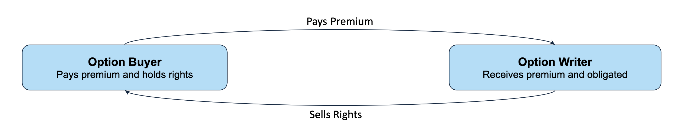
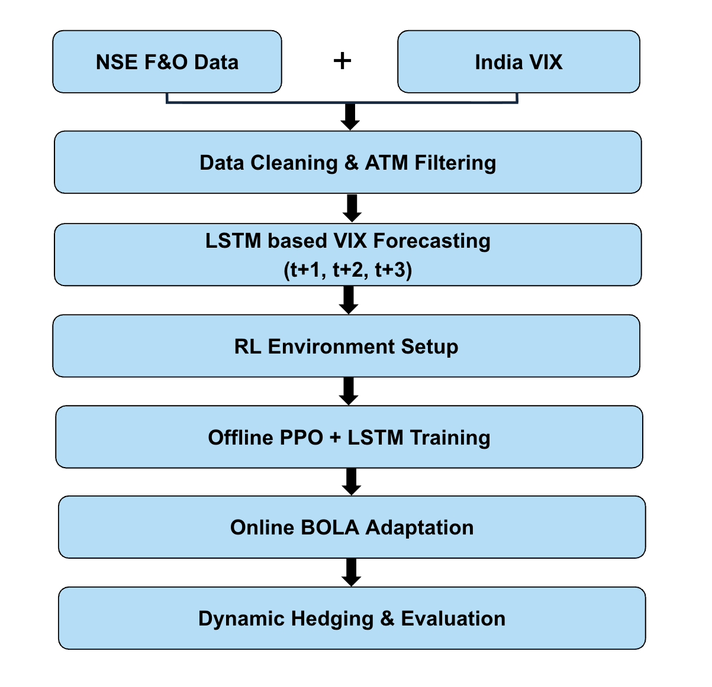
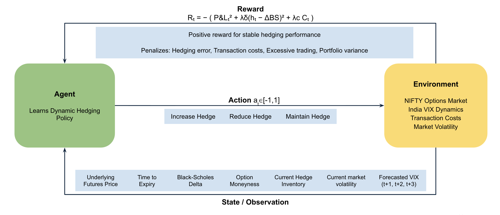
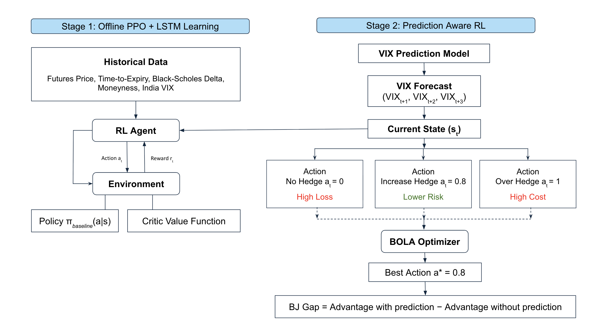
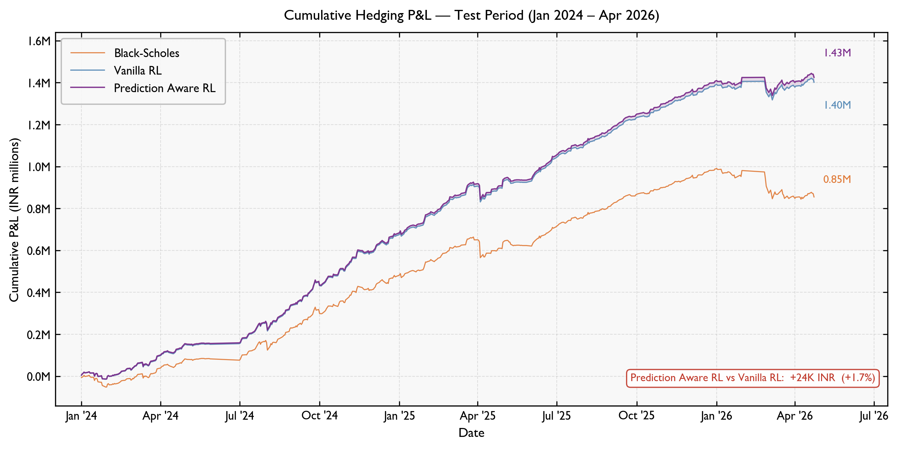
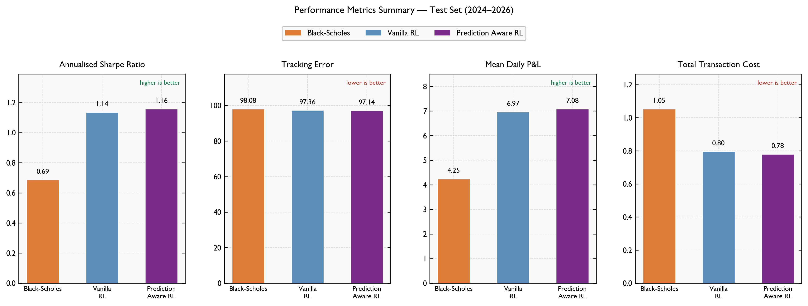
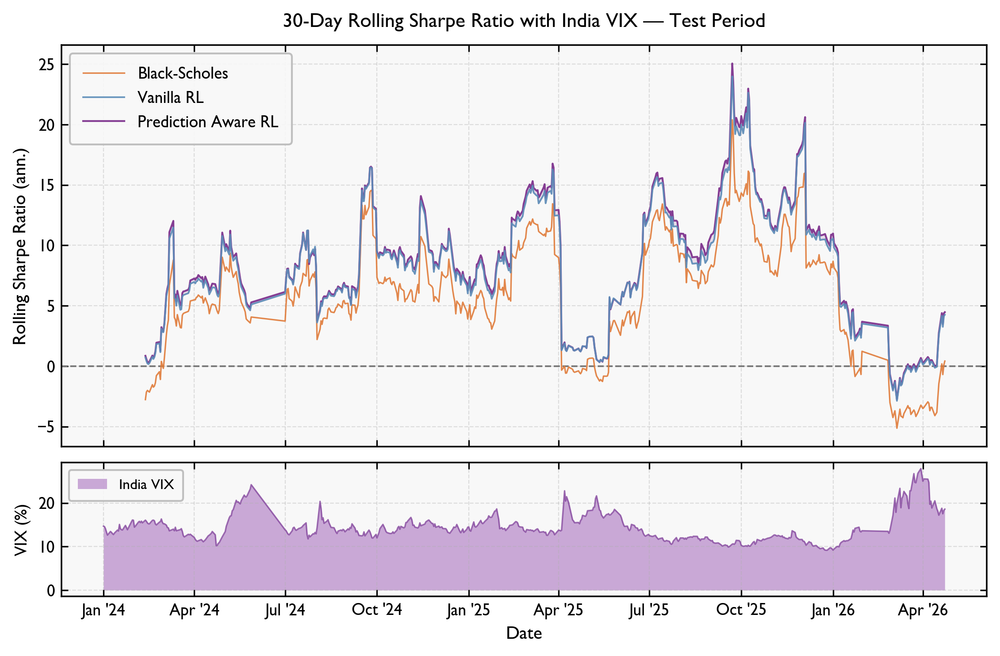
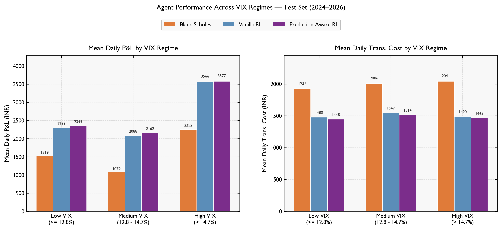
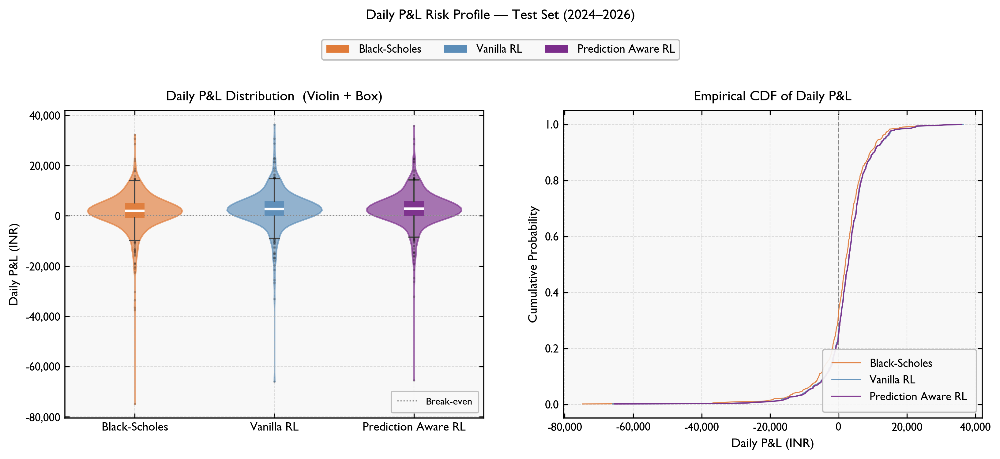

# Dynamic Option Hedging via Prediction-Aware Reinforcement Learning

This project evaluates **prediction-aware reinforcement learning** for hedging NIFTY 50 options portfolios on NSE. It compares four strategies:

| Strategy | Description |
|---|---|
| Black-Scholes | Classical delta hedge using option Greeks |
| Vanilla PPO+LSTM | PPO policy using option and market state history |
| VIX PPO+LSTM | PPO policy conditioned on VIX regime and multi-step VIX forecasts |
| BOLA+LSTM | Online blend of Vanilla PPO and VIX PPO gated by critic-value confidence |

BOLA (**Bayesian Online Learning via Adaptation**) dynamically shifts weight toward the VIX-aware expert when its predicted critic value exceeds the vanilla critic, allowing the agent to adapt to volatility regimes without retraining.

---

## Background — Options Hedging

<p align="center">
  
</p>

An **Option Writer** receives a premium in exchange for taking on the obligation to fulfil the contract. The writer's core risk is that large spot moves erode the premium collected. Dynamic hedging adjusts the hedge ratio continuously as market conditions change — this project learns that adjustment policy via RL rather than relying on fixed Black-Scholes delta.

---

## Data Pipeline

<p align="center">
  
</p>

| Stage | Description |
|---|---|
| NSE F&O Data + India VIX | Raw daily futures/options contracts and India VIX index |
| Data Cleaning & ATM Filtering | Remove bad contracts, keep near-ATM NIFTY options |
| LSTM-based VIX Forecasting | Train a sequence model to predict VIX at t+1, t+2, t+3 |
| RL Environment Setup | Wrap the option portfolio as a Gymnasium MDP |
| Offline PPO+LSTM Training | Train Vanilla and VIX-aware PPO policies on historical data |
| Online BOLA Adaptation | Critic-value gated blending of the two experts at test time |
| Dynamic Hedging & Evaluation | Run all agents on the held-out test set and compare |

---

## MDP Formulation

<p align="center">
  
</p>

---

## BOLA Framework

<p align="center">
  
</p>

BOLA operates in two stages:

**Stage 1 — Offline PPO+LSTM Learning**

Historical data (futures price, time-to-expiry, Black-Scholes delta, moneyness, India VIX) is used to train two PPO policies with an LSTM feature extractor — one Vanilla, one VIX-aware. Each produces a policy `π(a|s)` and a critic value function `V(s)`.

**Stage 2 — Prediction-Aware RL at Test Time**

The VIX LSTM forecaster predicts `VIX_{t+1}, VIX_{t+2}, VIX_{t+3}`. Given the current state `s_t` and the forecasts, the BOLA optimizer computes the **BJ Gap**:

```
BJ_Gap(t) = V_vix(s_t, vix_forecast_t) − V_vanilla(s_t)
```

A positive gap means the VIX-aware critic expects better outcomes than the vanilla critic. BOLA uses this gap to compute an adaptive blend weight `w ∈ [0, α]`:

```
action(t) = (1 − w) × Vanilla PPO action + w × VIX PPO action
```

An adaptive no-trade band filters micro-adjustments to reduce unnecessary transaction costs.

---

## Project Structure

```text
script_1_fetch_nifty_fo_data.py   Fetch/prepare NSE NIFTY F&O contract data
script_2_fetch_vix.py             Fetch/prepare NSE India VIX data
script_3_bs_baseline.py           Black-Scholes feature and baseline check
script_4_vanilla_ppo_baseline.py  Standalone vanilla PPO+LSTM baseline
script_5_bola_lstm_pipeline.py    Main pipeline: VIX forecaster, PPO, BOLA, evaluation
script_6_report_figures.py        Publication-quality report figures and statistical tests
mdp.py                            MDP flow diagram generator

data/                             Input and raw market data
models/                           Saved PPO and VIX forecasting model checkpoints
results/                          Features, simulation outputs, and summary metrics
reports/                          Report tables and figures
diagrams/                         Architecture and MDP diagrams
```

---

## Setup

```bash
python -m venv bola_env
source bola_env/bin/activate
pip install -r requirements.txt
```

All commands below assume the repository root as the working directory.

---

## Step 1 — Fetch NIFTY F&O Data

Fetch directly from NSE (may be rate-limited):

```bash
python script_1_fetch_nifty_fo_data.py --from 2020-09-01 --to 2026-04-26 --include-futures
```

If NSE blocks automated requests, download CSV files manually from NSE, place them under `data/nse_fo_raw/`, then run:

```bash
python script_1_fetch_nifty_fo_data.py --from-csv data/nse_fo_raw --output data/fobhav_nifty_nse_full.csv
```

Use `--include-futures` because NIFTY futures close is used as the underlying `SPOT` proxy.

Output: `data/fobhav_nifty_nse_full.csv`

---

## Step 2 — Fetch India VIX Data

Manual CSV download (most reliable):

```bash
python script_2_fetch_vix.py --from_csv data/vix_raw/
```

Cookie-based API:

```bash
python script_2_fetch_vix.py --nsit <NSIT_VALUE> --nseappid <NSEAPPID_VALUE>
```

Output: `data/india_vix.csv` — normalised to `DATE, VIX_OPEN, VIX_HIGH, VIX_LOW, VIX_CLOSE`.

---

## Step 3 — Run the Main BOLA Pipeline

```bash
python script_5_bola_lstm_pipeline.py
```

Inputs:

```text
data/fobhav_nifty_nse_full.csv
data/india_vix.csv
```

Pipeline stages:

```
1. Build or load Black-Scholes feature table  →  results/bs_features.csv
2. Train/test split (train ≤ 2023-12-31, test ≥ 2024-01-01)
3. Build VIX regime features (sigma, normalisation, momentum)
4. Train or load VIX forecasting LSTM  (t+1, t+2, t+3 forecasts)
5. Train or load PPO policies
     Vanilla PPO+LSTM  — option and market state history
     VIX PPO+LSTM      — adds realised and forecast VIX features
6. Run BOLA online adaptation (critic-value gated blending)
7. Evaluate all agents on the test set and write comparison CSVs
```

Outputs:

```text
models/vix_forecaster_lstm.pt
models/bola_offline_lstm.zip
results/bola_lstm_comparison.csv
results/bola_lstm_summary.csv
```

Force feature rebuild:

```bash
BOLA_REBUILD_FEATURES=1 python script_5_bola_lstm_pipeline.py
```

---

## Step 4 — Optional Vanilla PPO Baseline

```bash
python script_4_vanilla_ppo_baseline.py
```

Trains and evaluates Vanilla PPO+LSTM independently from the BOLA pipeline.

Input: `results/bs_features.csv`  
Outputs: `models/vanilla_ppo_lstm.zip`, `results/baseline_summary.csv`

---

## Step 5 — Generate Report Figures

```bash
python script_6_report_figures.py
```

Inputs: `results/bola_lstm_comparison.csv`, `results/bola_lstm_summary.csv`

Outputs:

```text
results/figures/fig1_cumulative_pnl.png
results/figures/fig2_performance_metrics.png
results/figures/fig3_rolling_sharpe.png
results/figures/fig4_vix_regime_analysis.png
results/figures/fig5_pnl_distribution.png
results/figures/fig_all_combined.png
reports/report_metrics.csv
reports/statistical_tests.csv
```

---

## Full Run From Scratch

```bash
# 1. Prepare NIFTY F&O data
python script_1_fetch_nifty_fo_data.py --from-csv data/nse_fo_raw --output data/fobhav_nifty_nse_full.csv

# 2. Prepare India VIX data
python script_2_fetch_vix.py --from_csv data/vix_raw/

# 3. Build features and run full BOLA experiment
python script_5_bola_lstm_pipeline.py

# 4. Generate final figures and report tables
python script_6_report_figures.py
```

If `data/fobhav_nifty_nse_full.csv` and `data/india_vix.csv` already exist, start from step 3.  
If `results/bs_features.csv` already exists, the pipeline reuses it unless `BOLA_REBUILD_FEATURES=1` is set.

---

## Results

Evaluated on 529 out-of-sample trading days (Jan 2024 – Apr 2026).

### Performance Summary

| Agent | Total P&L (₹) | Mean Daily P&L (₹) | Sharpe (Ann.) | Tracking Error | Total Trans. Cost (₹) |
|---|---|---|---|---|---|
| Black-Scholes | 854,979 | 1,616 | 0.69 | 98.08 | 1,053,451 |
| Vanilla PPO+LSTM | 1,402,046 | 2,650 | 1.14 | 97.36 | 796,354 |
| **BOLA+LSTM** | **1,425,810** | **2,695** | **1.16** | **97.14** | **780,489** |

BOLA+LSTM achieves the highest total P&L and Sharpe ratio while also incurring the lowest transaction costs across all 529 test days.

### Statistical Significance

| Comparison | Metric | Mean Diff | p-value | Cohen's d |
|---|---|---|---|---|
| BOLA vs Black-Scholes | Daily P&L | +₹1,079 | <0.001 | 0.60 |
| BOLA vs Black-Scholes | Transaction cost | −₹516 | <0.001 | −0.51 |
| BOLA vs Vanilla PPO | Daily P&L | +₹45 | <0.001 | 0.18 |
| BOLA vs Vanilla PPO | Transaction cost | −₹30 | <0.001 | −1.05 |

All P&L and cost differences are statistically significant (paired t-test, p < 0.001).

### Figures

<p align="center">
  
</p>

*Fig 1 — Cumulative P&L over the test period. BOLA+LSTM separates from both baselines, particularly during high-VIX episodes.*

<p align="center">
  
</p>

*Fig 2 — Performance metrics comparison: Sharpe ratio, tracking error, mean daily P&L, and total transaction cost.*

<p align="center">
  
</p>

*Fig 3 — 60-day rolling Sharpe ratio. BOLA maintains a more stable and elevated Sharpe through volatile periods.*

<p align="center">
  
</p>

*Fig 4 — P&L and cost breakdown by VIX regime (low / medium / high). BOLA's advantage is most pronounced in high-volatility regimes.*

<p align="center">
  
</p>

*Fig 5 — Daily P&L distribution. BOLA+LSTM shows a tighter left tail (fewer large losses) compared to Black-Scholes.*

---

## Notes

- The `SPOT` column in the feature dataset is derived from NIFTY futures close and used as the underlying proxy, consistent with futures-based hedging. For cash-index hedging, substitute actual NIFTY spot close.
- The train/test split is fixed at 2023-12-31 / 2024-01-01 to ensure the test set covers a full post-training market period.
- BOLA's no-trade band adapts between `BOLA_BAND_MIN` and `BOLA_BAND_MAX` based on realised VIX — it trades more aggressively during stress and less during calm periods.
